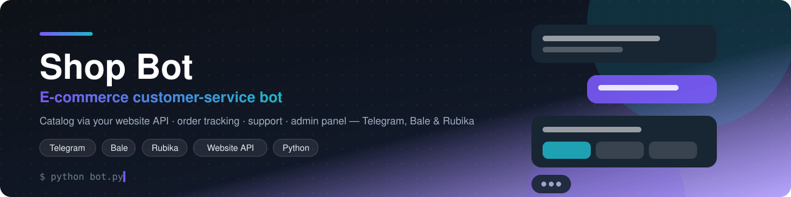
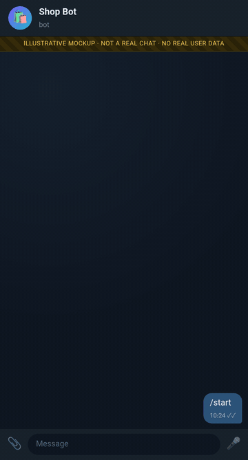
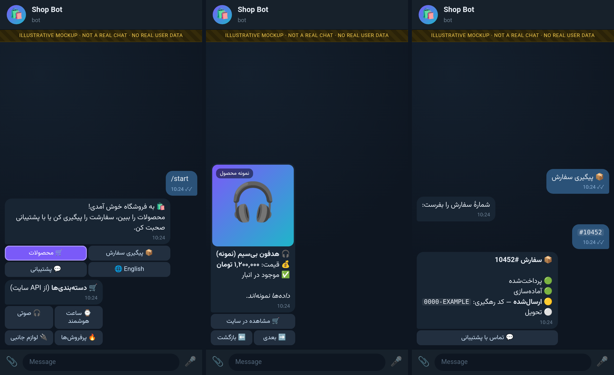

<!-- readme-top -->
<div align="center">



# Shop Bot — E-commerce Customer-Service Bot for Telegram, Bale & Rubika

[](LICENSE)     [](https://github.com/reza-em/multi-platform-shop-chatbot-telegram-bale/stargazers)

> Shop and customer-service bot for Telegram, Bale and Rubika: product catalog via website API, order status, support, admin panel and broadcast. Persian + English, Python requests, long polling.

**[فارسی](#-فارسی) · [English](#-english) · [Русский](#-русский) · [Deutsch](#-deutsch)**

⭐ **If this project is useful to you, please give it a star** — it helps other people find it. [**Star on GitHub**](https://github.com/reza-em/multi-platform-shop-chatbot-telegram-bale/stargazers) · 🍴 [Fork](https://github.com/reza-em/multi-platform-shop-chatbot-telegram-bale/fork) · 🐛 [Issues](https://github.com/reza-em/multi-platform-shop-chatbot-telegram-bale/issues)

</div>

## ✨ Highlights

- 🛍 **Product catalog** (categories, search, product cards) read from your shop's website API
- 📦 **Order tracking** with phone verification — orders are only shown to their owner
- 💬 **Support tickets** forwarded to admins, who answer through the bot
- 🔌 Configure the API (URL, key, auth style, endpoints, field mapping) **from inside the bot**
- 🟦 Same logic on **Telegram, Bale and Rubika**; Persian + English
- 🔐 Token / API-key redaction in logs, atomic state writes with file locks
- 🧪 Offline tests with mocked Telegram and mocked website

## 🎬 Demo

<div align="center">

</div>

<div align="center">

</div>

> 🖼 **These are illustrative mockups**, rendered locally from scripted conversations (see [`docs/mockups`](docs/mockups)). They are not real chats and contain no real user data; names, numbers and links are examples.

## 🚀 Quick start

```bash
git clone https://github.com/reza-em/multi-platform-shop-chatbot-telegram-bale.git && cd multi-platform-shop-chatbot-telegram-bale
pip install -r requirements.txt
export SHOP_TELEGRAM_BOT_TOKEN=...   # optional SHOP_BALE_BOT_TOKEN / SHOP_RUBIKA_BOT_TOKEN
export OWNER_USERNAME=your_telegram_username
./run.sh            # run_bale.sh / run_rubika.sh for the other platforms
python3 test_offline.py
```

More options, admin panel and platform notes are in the sections below. Tokens are read only from environment variables — never commit them.

---

## 🌐 فارسی

ربات فروشگاهی و پشتیبانی مشتری برای **تلگرام، بله و روبیکا**: نمایش محصولات از API سایت، پیگیری سفارش، پشتیبانی، پنل مدیر و ارسال همگانی. فارسی و انگلیسی؛ پایتون و long polling.

**کلیدواژه‌ها:** ربات فروشگاه تلگرام، ربات بله، ربات روبیکا، پشتیبانی مشتری، ربات فروشگاهی، پیگیری سفارش، فروشگاه آنلاین

## 🇬🇧 English

This is a shop / customer-service chatbot for **Telegram, Bale and Rubika**: browse products through a website API, track orders, contact support, admin panel and broadcast. Persian primary, English secondary; Python + requests with long polling and atomic JSON state.

**Keywords:** e-commerce Telegram bot, shop bot, customer support chatbot, Bale bot, Rubika bot, order tracking bot, Persian chatbot

## 🇷🇺 Русский

Бот интернет-магазина и поддержки клиентов для **Telegram, Bale и Rubika**: каталог товаров через API сайта, статус заказа, поддержка, админ-панель, рассылка. Персидский и английский; Python.

**Ключевые слова:** бот интернет-магазина Telegram, чат-бот поддержки клиентов, бот Bale, бот Rubika, отслеживание заказа

## 🇩🇪 Deutsch

Dies ist ein Shop- und Kundenservice-Bot für **Telegram, Bale und Rubika**: Produktkatalog über Website-API, Bestellstatus, Support, Admin-Panel und Rundnachrichten. Persisch/Englisch, Python.

**Stichwörter:** Shop Bot Telegram, E-Commerce Chatbot, Kundenservice Bot, Bale Bot, Rubika Bot, Bestellverfolgung

---

## Features

- Same logic on Telegram, Bale and Rubika (one process per platform)
- Catalog / product pages via the shop website API
- Admin panel and broadcast, per-user language
- Token and API key redaction in logs, atomic state writes with file locks
- Offline tests with mocked Telegram and mocked website

## Setup

```bash
pip install requests
export SHOP_TELEGRAM_BOT_TOKEN=...   # optional SHOP_BALE_BOT_TOKEN / SHOP_RUBIKA_BOT_TOKEN
export OWNER_USERNAME=your_telegram_username
./run.sh            # run_bale.sh / run_rubika.sh for the other platforms
python3 test_offline.py
```

> **Configuration note:** the owner/admin identity is read from environment variables (`OWNER_ID`, `OWNER_USERNAME`, `SUPPORT_USERNAME`) with the placeholder `example_owner`. Set them to your own values before running. Never commit bot tokens — they are read only from the environment.

## Usage

Open your bot in the messenger and send `/start`. See the detailed documentation below for commands, admin panel and platform-specific notes.

## License

Code released under the [MIT License](LICENSE).

---

## Detailed documentation

# Shop bot – customer-service bot (Telegram · Bale · Rubika)

Python 3 + plain `requests`, long polling. Persian (primary) + English, language stored per user.
State lives in `state.json` (atomic writes, file lock, mode 600).

## Run
```bash
export SHOP_TELEGRAM_BOT_TOKEN=...        # never commit / print it
setsid nohup ./run.sh >/dev/null 2>&1 &     # auto-restart loop, logs → bot.log, single instance
./stop.sh                                   # stop this project's loop + bot only
python3 test_offline.py                     # offline tests (mocked Telegram + mocked website)
```
Single instance is enforced twice: `run.lock` (one loop) and `bot.lock` (one bot process).
Logs go through a redacting formatter: the bot token and the website API key are replaced by
`<TOKEN>` / `<SECRET>`, and network errors never include request URLs.

## Files
| file | purpose |
|---|---|
| `bot.py` | handlers, menus, admin panel, main loop |
| `shop_api.py` | adapter layer: `ShopAPI` (abstract), `MockShopAPI`, `HttpShopAPI`, `NotConfiguredAPI`, `get_api()` |
| `notify.py` | `notify_user_order_update(order_number, status)` + documented webhook hook |
| `store.py` | state.json persistence (atomic, locked, 600) |
| `tg.py` | Telegram client, log redaction |
| `texts.py`, `ui.py` | fa/en strings, shared UI helpers |

## Features
/start (language picker on first use) → main menu (2-column inline buttons):
🛍 products (categories → paginated 2-col list → product card with price/photo/link) · 🔍 search ·
📦 track order (order number + phone verification) · 🧾 my orders (phone linked via Telegram contact button;
only the user's own contact is accepted) · 💬 support (forwarded to admin as tickets; admin answers via the
bot) · ❓ FAQ · 📞 about/contact (both admin-editable, fa+en) · 🌐 language.

Admin: numeric id auto-bound the first time the Telegram user `@example_owner` writes to the bot
(stored in state.json). `/admin` → stats, broadcast (preview + confirm), edit FAQ/About, support inbox
(reply button, or Telegram-Reply on the forwarded message), 🔌 API connection.

If the shop API is not configured, shop features answer a friendly "connection is being set up" message.
Nothing is fabricated. Example data appears **only** with `SHOP_USE_MOCK=1` (all names are prefixed
«[نمونه]» / "[MOCK]" and every screen carries an "example data" banner).

## Plugging in the real API (no code change needed in most cases)
Open the bot as admin → `/admin` → **🔌 اتصال API / API connection**:

1. **🌐 Base URL** – e.g. `https://shop.example/api/v1` (http:// works but warns).
2. **🔑 API key** – send it as a message; the bot deletes your message immediately, stores the key in
   `state.json` (chmod 600), and only ever shows it masked (`ab••••••yz`).
3. **🔐 Auth style** – `Bearer` (`Authorization: Bearer <key>`), `X-API-Key` header (name editable), or query
   parameter (name editable, default `api_key`).
4. **🛣 Endpoint paths** – relative to base URL; placeholders `{id} {q} {page} {per_page} {category} {order} {phone} {user}`.
   Query parameters whose value is empty are omitted. Defaults:

   | purpose | default |
   |---|---|
   | categories | `/categories` |
   | products | `/products?category={category}&page={page}&per_page={per_page}` |
   | product detail | `/products/{id}` |
   | search | `/products?search={q}&page={page}&per_page={per_page}` |
   | order lookup | `/orders/{order}` (add `?phone={phone}` if the site verifies phone itself) |
   | user orders | `/orders?phone={phone}` |
5. **🧬 Field mapping** – JSON key names, comma-separated alternatives (first non-empty wins), dot paths for
   nesting (`billing.phone`, `images.0.src`). Defaults are in `shop_api.FIELD_META`
   (product: `id,name,price,currency,image,url,short_description,in_stock`; order: `number,status,total,date,phone,tracking_code,items`;
   list array auto-detected: root array or `data/items/results/products/orders`; page count from
   `total_pages, meta.last_page, …` or `X-WP-TotalPages`).
6. **🧪 Test connection** – calls the products endpoint; reports HTTP status, latency, item count and one
   sample product name (or the top-level JSON keys if nothing could be mapped). No raw body, no secrets.
7. **⏻ Enable/disable** toggle. Env vars `SHOP_API_BASE_URL` / `SHOP_API_KEY` are only fallbacks for
   whatever is not saved in the panel.

Order status text from the site is mapped to cute canonical statuses (⏳💳🧴🎁🚚✅❌💸↩️⚠️⏸) by keyword
(English + Persian) in `shop_api.STATUS_KEYWORDS`; unknown text is shown as-is with ❔.

**Order privacy rule:** an order is shown only if its phone (`o_phone` mapping) matches the phone the user
supplied (last 10 digits, Persian digits accepted). If the API returns no phone field and the order
path does not contain `{phone}` (i.e. the site can't check ownership), the bot refuses to show it.
Lookups are rate-limited (5 failures / 10 min per user). Adjust `HttpShopAPI.get_order` if the site's
verification rule differs.

### If the site can't be expressed with the panel
`HttpShopAPI` (in `shop_api.py`) has a TODO docstring: edit `_request()` for POST/HMAC/XML/GraphQL and the
`_parse_*` methods for exotic shapes. `MockShopAPI` shows the exact interface to implement.

## Order-status notifications (no public port is opened)
```python
import notify
notify.notify_user_order_update("A100", "shipped")   # canonical key or raw site status
```
Users are subscribed automatically when they successfully track/list an order. Duplicate statuses are not
re-sent. When the site supports webhooks, add a small receiver (bind 127.0.0.1 behind HTTPS, verify a
shared secret with `hmac.compare_digest`) that calls `notify.handle_order_webhook(payload)` – see the
docstring at the top of `notify.py`.

## Pending / TODO
- Real base URL, key, docs → configure via the admin panel and tune paths/field mapping (verify with 🧪 Test).
- Confirm the site's order-ownership rule (phone field vs. server-side check).
- Fill FAQ and About texts from the panel.
- Optional: webhook receiver → `notify.handle_order_webhook`.


---
## Multi-platform layout (Telegram · Bale · Rubika)
Business logic (`bot.py`, `ui.py`, `notify.py`, `shop_api.py`, `texts.py`, `store.py`) is platform independent.
`transport.py` holds one `Transport` class per messenger (base URL, capability flags, quirks); `tg.py` is the
facade the logic calls. Select the platform with env `SHOP_PLATFORM=telegram|bale|rubika` (default telegram).
Each platform runs as its **own process** with its own files:

| platform | token env | start / stop | log | state | lock |
|---|---|---|---|---|---|
| Telegram | `SHOP_TELEGRAM_BOT_TOKEN` | `run.sh` / `stop.sh` | `bot.log` | `state.json` | `bot.lock` |
| Bale | `SHOP_BALE_BOT_TOKEN` | `run_bale.sh` / `stop_bale.sh` | `bale.log` | `state_bale.json` | `bot_bale.lock` |
| Rubika | `SHOP_RUBIKA_BOT_TOKEN` | `run_rubika.sh` / `stop_rubika.sh` | `rubika.log` | `state_rubika.json` | `bot_rubika.lock` |

Users, tickets, FAQ/About texts, order subscriptions and the admin binding are **per platform** (ids differ).
The **shop-API connection** (URL, key, auth style, paths, field mapping) is **shared** in `api_config.json`
(mode 600): configure it once from any platform's admin panel. (First start migrates an existing connection from
the platform's own state file.) `python3 test_offline.py` is run once per platform:
`SHOP_PLATFORM=bale python3 test_offline.py`. Log redaction covers every platform token and the API key.

## Bale notes (docs.bale.ai)
Base URL `https://tapi.bale.ai/bot<token>/<method>`. Compatible with Telegram's API, differences handled by `BaleTransport`:
- **No `parse_mode`**: all text is Markdown (`*bold*`, `_italic_`, `[t](url)`, bold/italic need a space around the
  marks). Our HTML subset is converted; `<code>` degrades to plain text; risky characters are swapped for look-alikes.
- `getUpdates` without `allowed_updates`; `answerCallbackQuery` is always sent, except for ids starting with `1`
  (old clients without support). Supported and used: inline keyboards, callback queries (64 B), `editMessageText`,
  `deleteMessage` (<48 h), `copyMessage`, `sendPhoto` by URL (≤5 MB; caption ≤1024 used), reply keyboard with
  `request_contact`, `ReplyKeyboardRemove`. Text limit 4096.
- `Contact.user_id` is documented as 32-bit; the bot accepts an exact or low-32-bit match with the sender id and
  rejects other/missing ids (env `SHOP_BALE_CONTACT_LENIENT=1` accepts a missing id — not recommended).
- Business API (`/business/bot…`, only file_id media, private chats) is **not** used; ordinary API rate limits apply
  (broadcasts are throttled at 20 msg/s and may be limited by Bale's interaction-based quota).
- Not used: mini-apps, wallet payments, `askReview`.

### Admin ownership on Bale / Rubika (claim code)
Usernames are not trusted there, so `@example_owner` does **not** auto-bind. On first start (no owner yet) a
one-time code like `3F9A-0B7C-D412` is generated, stored in `state_<platform>.json` (600) and printed **only** to that
platform's log (`bale.log`). Read it on the server: `grep "CLAIM CODE" bale.log`, then send
`/claim <code>` to the bot from the owner account. The bot deletes your message, binds your numeric id, and the code is
consumed. Wrong tries are limited (5/hour per user, 20/hour total). If the owner id ever has to change: stop the
bot, set `"admin_id": null` in the platform state file, start again → a new code is printed.


## Rubika notes (rubika.ir/botapi, Bot API v3)
`POST https://botapi.rubika.ir/v3/<token>/<method>` with JSON; replies `{"status":"OK","data":{…}}`. Rubika is **not**
Telegram-compatible, so `RubikaTransport` translates everything. Run: `./run_rubika.sh` / `./stop_rubika.sh`
(log `rubika.log`, state `state_rubika.json`, lock `bot_rubika.lock`), test: `python3 test_rubika.py`.

| topic | Rubika | what the adapter does |
|---|---|---|
| ids | string chat ids (`b0…`), sender `u0…` | private chat id ⇒ user identity; mapped to stable ints in `state_rubika.json` (`idmap`) |
| updates | `getUpdates(offset_id, limit)` → `updates`, `next_offset_id` (plain polling, no long-poll timeout) | polls every ~1.5 s when idle; offset persisted; old backlog skipped on the very first start; `NewMessage`, `StartedBot` (→ `/start`), `StoppedBot` (→ user marked blocked), `inline_message` |
| inline buttons | `inline_keypad {"rows":[{"buttons":[{"id","type":"Simple","button_text"}]}]}` | `callback_data` ⇒ button `id`; 2-column layout kept; URL buttons ⇒ `Link` (falls back to plain URLs in the text if rejected) |
| callback queries | no `answerCallbackQuery` | no-op |
| editing | `editMessageText` has no keypad | "edit panel" = send new message + delete old one |
| formatting | `metadata.meta_data_parts` (Bold/Italic/Mono/Pre/Underline/Link, UTF-16 offsets, ≤30) | HTML subset converted; if rejected, resent as plain text |
| photos | no photo-by-URL | product image downloaded (public http(s) only, ≤5 MB, SSRF-guarded), `requestSendFile` → upload → `sendFile`; on any failure a text card is sent |
| copyMessage | absent | text re-sent; other content via `forwardMessage` |
| contact sharing | `AskMyPhoneNumber` chat-keypad button → `contact_message` (**no user id**) | ownership of the number can't be verified ⇒ 🧾 "My orders" is **hidden/disabled** (`SHOP_RUBIKA_ALLOW_UNVERIFIED_CONTACT=1` to force). 📦 Track order (order no. + phone checked against the order) works |
| groups/channels | supported by Rubika | ignored (private chats only) |
| admin | usernames optional/unverified | `/claim <code>` (see Bale section; code printed only in `rubika.log`) |

**Verification status:** built strictly from the official docs and tested offline against a fake Rubika server. From the dev
box (US datacenter) `botapi.rubika.ir` closes the TLS handshake, so `getMe` could not be confirmed live from there. The
bot retries `getMe` every 60 s; if it never connects, run it from a host that can reach Rubika (e.g. an Iranian network).


## Admin panel: Users · Orders · Admins  (all platforms)
`/admin` → **👥 Users**, **🧾 Orders**, **👮 Admins** (plus the earlier sections).

* **👥 Users** – paginated (8/page, by last activity) list of this platform's users; 🔎 search by numeric id,
  @username, name part or phone. The user card shows name, username, id, join date, last activity (Jalali for fa /
  Gregorian for en, Tehran time), language, linked phone, ticket count, and buttons ✉️ message (delivered through the
  bot; the user's reply lands in the support inbox), 🚫 ban/unban (banned users are ignored, get one short notice per
  hour, are skipped by broadcasts and order notifications; admins can't be banned) and 🧾 orders.
* **🧾 Orders** – admin-only view of the shop API: recent orders (paginated), status filter, search by order number,
  detail (status, date, items, total, tracking, customer name/phone as mapped, and the bot user it belongs to).
  Uses the same connection / auth / field mapping as the rest. New settings in **🔌 API connection**:
  path **orders list (admin)** (default `/orders?page={page}&per_page={per_page}`; add `&status={status}` for
  server-side filtering, otherwise the filter is applied client-side to the fetched page) and field **customer name**
  (`o_name`). The order-detail lookup reuses the *order lookup* path but WITHOUT phone verification (admin only).
  If the API isn't configured or the list endpoint fails you get a clear message – never made-up data – and
  **🕘 User lookups** (a local log of orders users tracked via the bot, last 500) plus search stay available.
* **👮 Admins** (owner only) – add/remove extra admins by numeric id or @username (must have messaged the bot once);
  the person is notified. **👑 Change owner** asks for confirmation; the old owner becomes an extra admin.
  Extra admins get Users, Orders, Support inbox (reply/close) and FAQ/About; **owner-only** (enforced server-side
  for callbacks AND pending text prompts): API connection, stats, broadcast, admin management, owner change.
  New support tickets are still forwarded to the owner only; extra admins see them in the inbox.

**Role toggle on the user card (owner only):** the 👥 user card shows **👮 Make admin / Remove admin** (label follows the
current role). It reuses the Admins-section logic: the person is notified, removal asks for confirmation, the owner can't
be demoted, and a banned user must be unbanned first (a message with an ✅ Unban button is shown). Extra admins neither see
the button nor can trigger it (the `uad`/`urm`/`urmy` callbacks are owner-only server-side).

